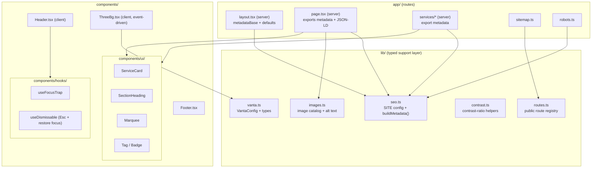

# Design Document

## Overview

This design describes how the Yorlex marketing website (Next.js 16 App Router, React 19, TypeScript 5, Tailwind CSS v4) will be brought up to a consistent quality bar across six dimensions: dependency/build health, code quality and linting, accessibility, SEO and metadata, performance, and consistency/maintainability. The work is a refactor of the existing codebase. It introduces no new pages, no new content, and no new product features, and it preserves the existing Brand_Design (brand purple `#a100ff`, sharp 0px corners, the Inter/Plus Jakarta type system, and the current layouts).

The guiding principle is **behavior-preserving improvement**: every page must render with the same visible DOM structure, text, and computed styles after the changes as before. Where that guarantee cannot be met for a refactor, the original markup is retained and the mismatch is surfaced as a build/type error rather than shipped silently (Requirement 6.5).

The design groups the work into independent workstreams that can be implemented and verified in isolation:

| Workstream | Primary Requirements | Verification approach |
|---|---|---|
| Dependency & build health | R1 | Clean-install + `next build` smoke checks |
| Lint & code hygiene | R2 | Lint run + DOM/style snapshot equivalence |
| Accessibility | R3 | Interaction tests + token-level property tests |
| SEO & metadata | R4 | Property tests over a typed metadata registry |
| Performance | R5 | Event-driven init + lifecycle tests |
| Consistency & shared components | R6 | Snapshot equivalence + `tsc` strictness |

Key research findings that inform the design:

- **React 19 + Next 16 use the automatic JSX runtime**, so a top-level `import React from "react"` is unnecessary and currently flagged as unused in `Header.tsx`, `Footer.tsx`, `app/page.tsx`, `ThreeBg.tsx`, and the service pages. Removing these imports is safe and does not change rendered output. ([React docs: JSX Transform](https://react.dev/blog/2024/04/25/react-19-upgrade-guide))
- **The Next.js Metadata API requires a Server Component** to export `metadata` or `generateMetadata`. Several pages are currently marked `"use client"`, so the interactive parts must be split into child client components while the route's `page.tsx` becomes a server component that owns metadata. ([Next.js Metadata](https://nextjs.org/docs/app/api-reference/functions/generate-metadata))
- **Next.js provides file-based `sitemap.ts` and `robots.ts` conventions** under `app/`, and a `metadataBase` option that resolves relative URLs and canonical/OG URLs to absolute. ([Next.js sitemap](https://nextjs.org/docs/app/api-reference/file-conventions/metadata/sitemap), [robots](https://nextjs.org/docs/app/api-reference/file-conventions/metadata/robots))
- **Vanta.js GLOBE requires a global `THREE`** to be present before initialization. The current implementation polls with `setInterval(initVanta, 100)`; this can be replaced by `next/script` `onLoad` callbacks (event-driven) that load Three.js, then Vanta, then initialize exactly once. ([next/script](https://nextjs.org/docs/app/api-reference/components/script))
- **Installed versions** (from `node_modules`) are `framer-motion@12.42.0` and `lucide-react@1.21.0`; these are imported throughout but absent from `package.json`.

## Architecture

The site keeps its current App Router structure. The design adds a small, typed support layer under a new `lib/` directory and a shared UI layer under `components/ui/`, and it restructures client-only route components.



Design decisions and rationale:

1. **Centralize SEO in `lib/seo.ts` as a pure function.** A single `buildMetadata(routeKey)` derives Next `Metadata` from a typed per-route config merged with site-wide defaults. This makes metadata completeness and defaulting (R4.1–4.3, 4.7) a property of one pure function rather than scattered literals, and makes it testable without rendering.
2. **A single public route registry (`lib/routes.ts`).** Both the metadata layer and `sitemap.ts` consume the same source of truth so the sitemap can enumerate every public route exactly once (R4.4) and titles/canonicals stay aligned.
3. **Server/Client split for interactive pages.** Pages that export metadata become server components; their interactive bodies move to colocated client components (e.g., `app/page.tsx` server wrapper rendering a `HomeContent` client component). This is required because the Metadata API is server-only and keeps DOM output identical (R2.7, R6.4).
4. **Event-driven Background_Effect.** `ThreeBg.tsx` loads scripts via `next/script` with `strategy="afterInteractive"` and initializes Vanta inside `onLoad`, removing the `setInterval` polling loop (R5.1–5.3), with a 10s timeout fallback and deterministic teardown (R5.5, 5.7).
5. **Shared UI primitives in `components/ui/`.** Repeated card/section/marquee/badge patterns become typed components reused across pages so duplicated markup is eliminated while preserving rendered output (R6.1, 6.4).

## Components and Interfaces

### `lib/seo.ts` — metadata builder

```ts
export interface OgImage {
  url: string;        // absolute or root-relative; resolved against metadataBase
  width: number;      // >= 1200
  height: number;     // >= 630
  alt: string;        // 1..125 chars
}

export interface PageSeo {
  /** Route path, e.g. "/services/technology". Used as canonical + og:url. */
  path: string;
  title?: string;        // 1..60 chars; unique across pages
  description?: string;  // 1..160 chars
  ogImage?: OgImage;
}

export interface SiteSeoDefaults {
  baseUrl: string;       // absolute, e.g. "https://www.yorlex.com"
  titleTemplate: string; // e.g. "%s | Yorlex"
  defaultTitle: string;
  defaultDescription: string;
  defaultOgImage: OgImage;
}

/** Pure: merges page config with defaults and returns a fully-populated Next Metadata. */
export function buildMetadata(page: PageSeo): import("next").Metadata;
```

`buildMetadata` always returns a `Metadata` object in which `title`, `description`, `openGraph.{title,description,images,url}`, and `alternates.canonical` are present and non-empty. Missing page fields fall back to site defaults (R4.3). `metadataBase` is set in `app/layout.tsx` so relative `og:image`/canonical paths resolve to absolute URLs (R4.2, 4.7).

### `lib/routes.ts` — public route registry

```ts
export interface PublicRoute {
  path: string;            // absolute path, leading slash, no trailing slash (except "/")
  changeFrequency?: "weekly" | "monthly";
  priority?: number;       // 0..1
}

export const PUBLIC_ROUTES: readonly PublicRoute[];
```

### `app/sitemap.ts` / `app/robots.ts`

```ts
// sitemap.ts
export default function sitemap(): import("next").MetadataRoute.Sitemap;
// robots.ts
export default function robots(): import("next").MetadataRoute.Robots; // includes absolute sitemap URL
```

`sitemap()` maps `PUBLIC_ROUTES` to entries with absolute URLs (`${baseUrl}${path}`), each route appearing exactly once (R4.4). `robots()` returns crawl rules and `sitemap: ${baseUrl}/sitemap.xml` (R4.5).

### `components/ThreeBg.tsx` — event-driven background

```ts
import type { VantaEffect, VantaGlobeFactory } from "../lib/vanta";

// Internal contract (no `any`):
declare global {
  interface Window {
    THREE?: unknown;
    VANTA?: { GLOBE?: VantaGlobeFactory };
  }
}
```

Behavior:
- Renders two `next/script` tags (Three.js, then Vanta GLOBE) with `strategy="afterInteractive"`.
- On the Vanta script `onLoad`, calls `initVanta()` exactly once guarded by a ref flag (R5.2).
- A 10s `setTimeout` fallback flips to a "no effect" state and clears on success; failure leaves the page interactive with no thrown error (R5.5).
- Cleanup calls `effect.destroy()` and clears the timeout on unmount (R5.7).
- Uses the existing config values (`color: 0xb19799`, `color2: "rgba(161,0,255,0.3)"`, `backgroundColor: 0x0d0d0e`, `scale: 1.0`) unchanged (R5.6).

### `components/ui/*` — shared primitives

```ts
export interface ServiceCardProps {
  href: string;
  title: string;
  description: string;
  icon: import("lucide-react").LucideIcon;
  tags: readonly string[];
  variant?: "light" | "dark" | "accent";
  span?: "sm" | "lg" | "tall" | "full"; // bento grid sizing
}

export interface SectionHeadingProps {
  title: string;
  description?: string;
  align?: "left" | "center";
}

export interface MarqueeProps {
  children: React.ReactNode;
  speedSeconds?: number; // defaults to 25 (matches current animation)
}
```

Each shared component reproduces the exact class strings currently used at its call sites so rendered DOM and CSS classes are unchanged (R6.4).

### `components/Header.tsx` — accessibility upgrades

- The Capabilities trigger gets `aria-haspopup="true"` and `aria-expanded={activeDropdown}` (R3.8).
- The search modal becomes `role="dialog"` `aria-modal="true"` with a labelled input; it uses `useFocusTrap` (R3.5) and `useDismissable` for `Escape`/restore-focus (R3.6, 3.7).
- The mobile drawer trigger gets `aria-expanded`/`aria-controls`; the drawer uses the same dismiss hook.
- Interactive elements gain a visible `focus-visible` ring (≥2px, ≥3:1 contrast) via Tailwind `focus-visible:ring-2 focus-visible:ring-brand-purple` style utilities (R3.4).

### `components/hooks/`

```ts
export function useFocusTrap(active: boolean): React.RefObject<HTMLElement>;
export function useDismissable(opts: {
  isOpen: boolean;
  onClose: () => void;
  triggerRef: React.RefObject<HTMLElement | null>;
}): void; // Esc closes within 200ms; restores focus to trigger or document.body
```

## Data Models

### SiteSeoDefaults (singleton config)

```ts
export const SITE: SiteSeoDefaults = {
  baseUrl: "https://www.yorlex.com",
  titleTemplate: "%s | Yorlex",
  defaultTitle: "Yorlex Enterprise — Multi-Disciplinary Excellence",
  defaultDescription: "Yorlex architects resilient systems and strategic frameworks for the global enterprise.",
  defaultOgImage: { url: "/hero-bg.png", width: 1200, height: 630, alt: "Yorlex Enterprise" },
};
```

### Per-page SEO entries

A map keyed by route path supplies page-specific overrides; absent fields resolve to `SITE` defaults.

```ts
export const PAGE_SEO: Record<string, PageSeo>;
```

### Image catalog (`lib/images.ts`)

Models every rendered image so alt-text rules are enforced centrally (R3.2, 3.3).

```ts
export interface ImageAsset {
  src: string;
  width: number;
  height: number;
  role: "content" | "decorative";
  alt: string; // content => 1..125 chars; decorative => ""
}
export const IMAGE_CATALOG: readonly ImageAsset[];
```

### Vanta configuration (`lib/vanta.ts`)

```ts
export interface VantaGlobeConfig {
  el: HTMLElement;
  THREE: unknown;
  mouseControls: boolean;
  touchControls: boolean;
  gyroControls: boolean;
  minHeight: number;
  minWidth: number;
  scale: number;
  scaleMobile: number;
  color: number;
  color2: string;
  backgroundColor: number;
}
export interface VantaEffect { destroy(): void; }
export type VantaGlobeFactory = (config: VantaGlobeConfig) => VantaEffect;

export const VANTA_GLOBE_CONFIG: Omit<VantaGlobeConfig, "el" | "THREE">;
```

### Contrast model (`lib/contrast.ts`)

```ts
export interface ColorPair { fg: string; bg: string; largeText: boolean; }
export function contrastRatio(fg: string, bg: string): number; // WCAG relative-luminance ratio, 1..21
export const TEXT_COLOR_PAIRS: readonly ColorPair[]; // approved foreground/background token combinations in use
```

## Correctness Properties

*A property is a characteristic or behavior that should hold true across all valid executions of a system — essentially, a formal statement about what the system should do. Properties serve as the bridge between human-readable specifications and machine-verifiable correctness guarantees.*

These properties target the pure support layer introduced by this design — the metadata builder (`buildMetadata`), the sitemap generator, the image catalog, and the contrast helper. Because these are pure functions over structured data with universal invariants, they are strong property-based-testing candidates. The remaining requirements (build/install, lint, rendered-output equivalence, focus/ARIA interactions, script lifecycle) are not universally-quantified logic and are covered by smoke, snapshot, and example/integration tests in the Testing Strategy instead.

### Property 1: Metadata field bounds and title uniqueness

*For any* set of pages in the SEO registry, the metadata produced by `buildMetadata` SHALL have a resolved `title` of length 1 to 60 characters and a resolved `description` of length 1 to 160 characters for every page, and the collection of resolved titles SHALL contain no duplicates across pages.

**Validates: Requirements 4.1**

### Property 2: Open Graph completeness and image dimensions

*For any* page in the SEO registry, the metadata produced by `buildMetadata` SHALL include non-empty `og:title`, `og:description`, `og:url`, and `og:image`, where the `og:image` declares an explicit width of at least 1200 and height of at least 630.

**Validates: Requirements 4.2**

### Property 3: Default fallback for omitted fields

*For any* page configuration and *any* subset of its optional fields (`title`, `description`, `ogImage`) omitted, the metadata produced by `buildMetadata` SHALL still expose every required field as non-empty, substituting the corresponding site-wide default for each omitted field.

**Validates: Requirements 4.3**

### Property 4: Exactly one absolute canonical URL

*For any* page in the SEO registry, the metadata produced by `buildMetadata` SHALL expose exactly one canonical URL, and that URL SHALL be absolute (parseable with a protocol and host).

**Validates: Requirements 4.7**

### Property 5: Sitemap is an exact, absolute cover of public routes

*For any* public-route registry, the output of `sitemap()` SHALL contain exactly one entry per registered route (a one-to-one cover with no omissions and no duplicates), and every entry's `url` SHALL be an absolute URL.

**Validates: Requirements 4.4**

### Property 6: Image alt-text rules by role

*For any* entry in the image catalog, IF the entry's role is `content` THEN its `alt` SHALL be a non-empty string of length 1 to 125 characters, and IF the entry's role is `decorative` THEN its `alt` SHALL be the empty string.

**Validates: Requirements 3.2, 3.3**

### Property 7: Text contrast meets WCAG thresholds

*For any* approved foreground/background color pair used for text, the computed contrast ratio SHALL be at least 4.5:1 when the text is normal-size and at least 3:1 when the text is large-size.

**Validates: Requirements 3.9**

## Error Handling

- **Missing/partial SEO config (R4.3):** `buildMetadata` never throws on absent fields; it merges against `SITE` defaults so the returned `Metadata` is always fully populated. Defaulting is total over the input space (Property 3).
- **Background_Effect script failure or slow load (R5.5):** `ThreeBg` registers `next/script` `onError` handlers and a 10s timeout. On either, it sets an internal `failed` state, skips initialization, logs a single non-fatal `console.warn`, and renders the page without the effect. No uncaught error propagates and the page stays interactive.
- **Double initialization guard (R5.2):** initialization is wrapped in a ref-backed `initialized` flag so concurrent `onLoad` events (Three.js + Vanta) cannot create more than one effect instance.
- **Unmount teardown (R5.7):** the cleanup function calls `effect.destroy()` inside a `try/catch` (errors swallowed, as destroying an already-torn-down effect is benign) and clears the pending timeout.
- **Focus restoration when trigger is gone (R3.7):** `useDismissable` checks `triggerRef.current?.isConnected`; if the trigger is detached, focus is moved to `document.body` instead of a removed node, preventing focus loss.
- **Refactor mismatch fallback (R6.5):** shared UI component props are typed so a call site that cannot reproduce the original markup fails type-checking (`tsc`) rather than rendering altered output; where a page cannot be expressed through the shared component, the original markup is retained.
- **Image optimization config:** remote image hosts used by service pages (e.g. `lh3.googleusercontent.com`) are added to `next.config.ts` `images.remotePatterns`; an unconfigured host surfaces as a build/runtime Next.js error rather than a silently broken image.

## Testing Strategy

### Dual approach

Property-based tests verify the universal invariants of the pure support layer (Properties 1–7). Example, snapshot, smoke, and integration tests cover everything else: tooling outcomes, rendered-output equivalence, and component interactions.

### Property-based tests

- **Library:** `fast-check` with the existing test runner for a Next.js/TS project (Vitest or Jest). Property-based testing is NOT implemented from scratch.
- **Iterations:** each property test runs a minimum of 100 iterations.
- **Generators:** custom arbitraries for `PageSeo` (varying presence/absence and lengths of `title`, `description`, `ogImage`), `PublicRoute[]` registries, `ImageAsset` entries (content/decorative), and `ColorPair` sets drawn from the approved token palette. For registry-wide properties (1, 5) the generator produces whole collections.
- **Tagging:** each property test is tagged with a comment in the format `Feature: project-improvements, Property {number}: {property_text}`.
- **Mapping:** exactly one property-based test per correctness property (Properties 1–7).

### Example and edge-case unit tests

- **Robots output (4.5):** assert crawl rules and an absolute sitemap URL.
- **Organization JSON-LD (4.6):** validate the emitted structured data against the schema.org Organization type.
- **Search modal focus trap (3.5):** open modal → focus on first control → `Tab`/`Shift+Tab` cycles within modal.
- **Escape + focus restore (3.6) and trigger-gone fallback (3.7):** `Escape` closes and restores focus to trigger, or to `document.body` when the trigger is detached.
- **ARIA state (3.8):** `aria-expanded`/`role`/`aria-modal` toggle with open/close.
- **Focus ring (3.4):** representative controls expose a `focus-visible` ring of ≥2px in the brand color.
- **Background_Effect lifecycle (5.2, 5.5, 5.6, 5.7):** mock script `onLoad`/`onError`/timeout — assert single factory call, graceful failure with no throw, config equals baseline values, and `destroy()` on unmount.

### Snapshot / visual-equivalence tests (R2.7, R6.4)

- Capture a baseline DOM + class snapshot of every page before changes.
- After lint cleanup and shared-component extraction, assert each page's rendered DOM structure, text content, and applied CSS classes match the baseline. Any divergence fails the suite (and, for shared components, is also caught at compile time per R6.5).

### Smoke / integration checks (R1, R2.1–2.6, R3.1, R5.1/5.3/5.4, R6.1–6.3)

- **Clean install + build (1.4, 1.5):** in a fresh environment run `npm install` then `next build`; assert exit code 0. Negative check (1.6) optionally removes a dependency to confirm an unresolved-module error surfaces.
- **Manifest declarations (1.1–1.3):** assert `framer-motion` and `lucide-react` are present and resolve to the installed versions (`12.42.0`, `1.21.0`).
- **Lint (2.1–2.5, 3.1, 6.2):** run ESLint; assert zero errors and zero warnings; assert no deprecated Tailwind classes, no hardcoded brand-color literals, no raw ``, no unused `React` imports.
- **Type strictness (2.6, 6.3):** run `tsc --noEmit` under strict mode; assert no `any` and no type-suppression directives.
- **Performance structure (5.1, 5.3, 5.4):** assert `ThreeBg` contains no `setInterval`, uses `next/script` with a non-blocking strategy, and that images use `next/image`.

### Notes on what is intentionally NOT property-tested

Build/install success, lint/type cleanliness, rendered-output equivalence, ARIA/focus interactions, and script-loading lifecycle do not vary meaningfully with generated input (their behavior is fixed or determined by tooling), so running 100+ randomized iterations adds no value. These are covered by the smoke, snapshot, and example tests above.
