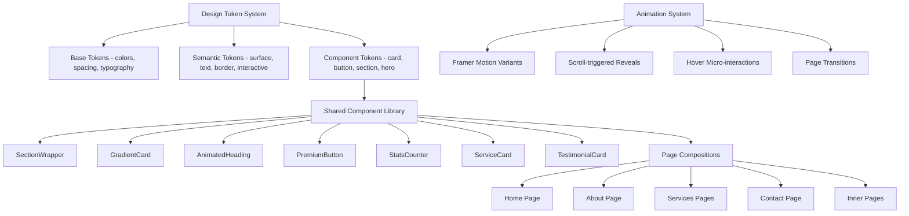
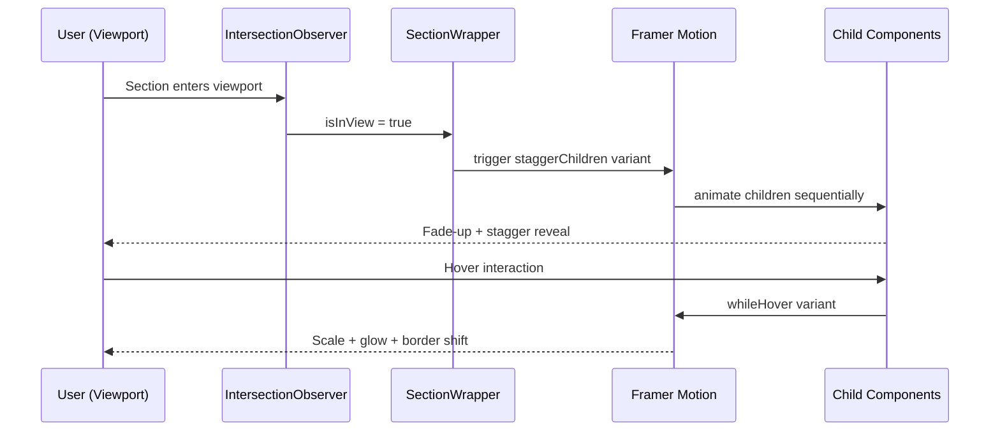
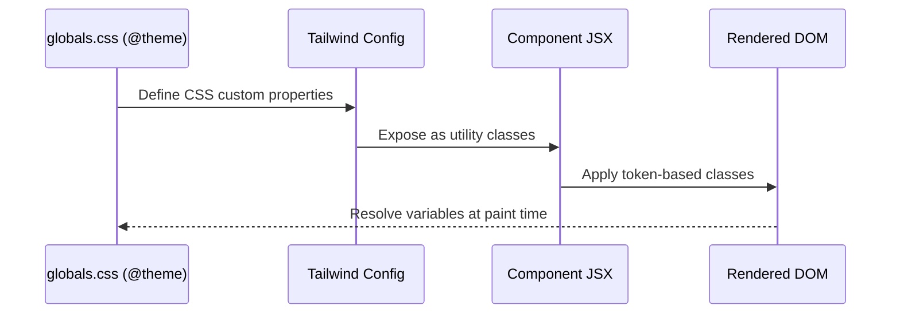

# Design Document: UI Design Overhaul

## Overview

This design overhaul elevates the Yorlex startup website from its current functional state to a premium, polished B2B enterprise experience. The focus is on improving visual hierarchy, spacing rhythm, typography scale, component patterns, micro-interactions, and overall design consistency — while preserving the existing dark theme, brand purple (#a100ff), sharp architectural corners (0px radius), and the Inter + Plus Jakarta Sans type system.

The current site has the right foundations (dark hero, bento grids, sharp edges, uppercase labels) but suffers from inconsistent spacing, lack of breathing room, missing polish on hover/transition states, underdeveloped section transitions, and repetitive visual patterns across pages. This overhaul introduces a formal design token system, reusable component library, improved whitespace rhythm, gradient depth layers, and sophisticated micro-interactions that elevate the perceived quality without changing the brand identity.

The key principle: **make the existing design language feel expensive and intentional**, not redesign it.

## Architecture



## Sequence Diagrams

### Component Render Flow with Animations



### Design Token Resolution



## Components and Interfaces

### Component 1: SectionWrapper

**Purpose**: Provides consistent vertical rhythm, max-width constraints, scroll-reveal animation, and optional background treatments for every page section.

**Interface**:
```typescript
interface SectionWrapperProps {
  children: React.ReactNode;
  className?: string;
  background?: 'default' | 'white' | 'dark' | 'gradient' | 'grid';
  spacing?: 'compact' | 'default' | 'generous';
  animate?: boolean;
  id?: string;
}
```

**Responsibilities**:
- Enforce consistent section padding (py-20 compact, py-28 default, py-36 generous)
- Apply max-w-7xl centering with responsive px-6 padding
- Trigger scroll-based fade-up animation via IntersectionObserver
- Apply background variants (architectural grid, gradient mesh, solid dark)
- Provide stagger-children animation container

### Component 2: GradientCard

**Purpose**: A premium card component with subtle gradient borders, glow effects on hover, and consistent internal spacing.

**Interface**:
```typescript
interface GradientCardProps {
  children: React.ReactNode;
  variant?: 'default' | 'dark' | 'featured' | 'glass';
  hover?: 'glow' | 'lift' | 'border' | 'none';
  className?: string;
  as?: 'div' | 'article' | 'a';
  href?: string;
}
```

**Responsibilities**:
- Render sharp-cornered card with gradient border on hover
- Apply variant-specific backgrounds (white, dark #0d0d0e, glass blur, featured with purple accent)
- Animate hover state with configurable effect (glow shadow, lift transform, border color)
- Maintain 0px border-radius brand constraint

### Component 3: AnimatedHeading

**Purpose**: Typography component that handles the brand's heading hierarchy with scroll-reveal and optional gradient text effects.

**Interface**:
```typescript
interface AnimatedHeadingProps {
  children: React.ReactNode;
  level: 1 | 2 | 3 | 4;
  gradient?: boolean;
  className?: string;
  delay?: number;
}
```

**Responsibilities**:
- Render appropriate heading tag (h1-h4) with Plus Jakarta Sans font
- Apply type scale: h1=5xl-7xl, h2=3xl-4xl, h3=xl-2xl, h4=lg
- Optional gradient text (brand-purple to brand-blue)
- Fade-up animation with configurable delay for stagger effects
- Enforce uppercase + tracking-tight brand convention

### Component 4: PremiumButton

**Purpose**: Elevated CTA button with gradient backgrounds, hover animations, and loading states.

**Interface**:
```typescript
interface PremiumButtonProps {
  children: React.ReactNode;
  variant?: 'primary' | 'secondary' | 'ghost' | 'gradient';
  size?: 'sm' | 'md' | 'lg';
  href?: string;
  onClick?: () => void;
  icon?: React.ReactNode;
  loading?: boolean;
  className?: string;
}
```

**Responsibilities**:
- Primary: solid black bg, white text, hover → brand-purple
- Secondary: transparent with border, hover → fill black
- Ghost: no border, text-only with underline reveal on hover
- Gradient: purple→blue gradient with animated shimmer on hover
- All variants maintain 0px border-radius, uppercase tracking-wider styling
- Icon slot with translate-x animation on hover

### Component 5: StatsCounter

**Purpose**: Animated number counter for metrics/social-proof sections with scroll-triggered count-up.

**Interface**:
```typescript
interface StatsCounterProps {
  value: number;
  suffix?: string;
  prefix?: string;
  label: string;
  duration?: number;
}
```

**Responsibilities**:
- Animate from 0 to target value when entering viewport
- Display suffix ("+", "%", "k") and prefix ("$", "£")
- Use Plus Jakarta Sans font-black for the number
- Subtle scale-up animation on hover

### Component 6: ServiceCard (Bento)

**Purpose**: The redesigned bento grid card used on the home and services pages with improved visual hierarchy.

**Interface**:
```typescript
interface ServiceCardProps {
  title: string;
  description: string;
  icon: React.ComponentType<{ className?: string }>;
  href: string;
  tags?: string[];
  variant?: 'large' | 'tall' | 'standard' | 'featured';
  status?: { label: string; active: boolean };
}
```

**Responsibilities**:
- Apply grid span based on variant (large=col-span-8, tall=col-span-4 row-span-2, standard=col-span-4)
- Render icon with animated container (border glow on hover)
- Show tags as micro-labels with hover color transition
- Featured variant: purple background with white text
- Animated top-border reveal on hover (scale-x from 0 to 1)
- Stagger-reveal children on scroll enter

## Data Models

### Design Token System

```typescript
// Design tokens defined in globals.css @theme
interface DesignTokens {
  colors: {
    // Brand (unchanged)
    'brand-dark': '#000000';
    'brand-purple': '#a100ff';
    'brand-blue': '#007aff';
    'brand-bg': '#f9f9f9';
    'brand-text': '#1b1b1b';
    'brand-border': '#e2e2e2';
    'brand-border-light': '#f0f0f0';
    
    // NEW: Extended surface palette
    'surface-elevated': '#ffffff';
    'surface-subtle': '#fafafa';
    'surface-muted': '#f5f5f5';
    'surface-dark': '#0d0d0e';
    'surface-dark-elevated': '#1a1a1c';
    'surface-dark-muted': '#141416';
    
    // NEW: Extended text palette  
    'text-primary': '#1b1b1b';
    'text-secondary': '#4b5563';
    'text-tertiary': '#9ca3af';
    'text-quaternary': '#d1d5db';
    'text-on-dark': '#f9fafb';
    'text-on-dark-muted': '#9ca3af';
    
    // NEW: Interactive states
    'interactive-hover': 'rgba(161, 0, 255, 0.08)';
    'interactive-active': 'rgba(161, 0, 255, 0.12)';
    'interactive-focus': 'rgba(161, 0, 255, 0.24)';
    'glow-purple': 'rgba(161, 0, 255, 0.15)';
    'glow-purple-strong': 'rgba(161, 0, 255, 0.3)';
  };
  
  spacing: {
    'section-compact': '5rem';    // 80px - py-20
    'section-default': '7rem';    // 112px - py-28
    'section-generous': '9rem';   // 144px - py-36
    'content-gap': '1.5rem';      // 24px
    'card-padding': '2rem';       // 32px
    'card-padding-lg': '2.5rem';  // 40px
  };
  
  typography: {
    'display-hero': { size: '4.5rem'; weight: 900; leading: '1.05'; tracking: '-0.02em' };
    'display-section': { size: '2.5rem'; weight: 900; leading: '1.1'; tracking: '-0.01em' };
    'display-card': { size: '1.25rem'; weight: 700; leading: '1.3'; tracking: '0.05em' };
    'body-large': { size: '1.125rem'; weight: 400; leading: '1.7'; tracking: '0' };
    'body-default': { size: '0.875rem'; weight: 400; leading: '1.6'; tracking: '0' };
    'label-micro': { size: '0.625rem'; weight: 700; leading: '1'; tracking: '0.1em' };
  };

  animation: {
    'ease-out-expo': 'cubic-bezier(0.16, 1, 0.3, 1)';
    'ease-in-out-smooth': 'cubic-bezier(0.4, 0, 0.2, 1)';
    'duration-fast': '150ms';
    'duration-normal': '300ms';
    'duration-slow': '500ms';
    'stagger-children': '80ms';
  };
}
```

**Validation Rules**:
- All colors must maintain WCAG AA contrast ratios against their intended background
- Spacing values must follow a 4px base-unit system
- Typography scale must maintain clear hierarchy (each level visually distinct)
- Animation durations must not exceed 500ms for interactive feedback

### Animation Variants

```typescript
// Shared Framer Motion variants
interface AnimationVariants {
  fadeUp: {
    hidden: { opacity: 0; y: 24 };
    visible: { opacity: 1; y: 0; transition: { duration: 0.5; ease: [0.16, 1, 0.3, 1] } };
  };
  
  staggerContainer: {
    hidden: { opacity: 0 };
    visible: { opacity: 1; transition: { staggerChildren: 0.08; delayChildren: 0.1 } };
  };
  
  scaleIn: {
    hidden: { opacity: 0; scale: 0.95 };
    visible: { opacity: 1; scale: 1; transition: { duration: 0.4; ease: [0.16, 1, 0.3, 1] } };
  };
  
  slideInLeft: {
    hidden: { opacity: 0; x: -30 };
    visible: { opacity: 1; x: 0; transition: { duration: 0.5; ease: [0.16, 1, 0.3, 1] } };
  };

  hoverLift: {
    rest: { y: 0; boxShadow: '0 0 0 rgba(161,0,255,0)' };
    hover: { y: -4; boxShadow: '0 20px 60px rgba(161,0,255,0.1)' };
  };

  hoverGlow: {
    rest: { boxShadow: '0 0 0 rgba(161,0,255,0)' };
    hover: { boxShadow: '0 0 40px rgba(161,0,255,0.15), 0 0 80px rgba(161,0,255,0.05)' };
  };
}
```

## Algorithmic Pseudocode

### Scroll-Reveal Animation System

```typescript
// Core scroll-reveal hook used by SectionWrapper and individual components
function useScrollReveal(options?: { threshold?: number; rootMargin?: string }) {
  const ref = useRef<HTMLElement>(null);
  const [isInView, setIsInView] = useState(false);
  
  useEffect(() => {
    const observer = new IntersectionObserver(
      ([entry]) => {
        if (entry.isIntersecting) {
          setIsInView(true);
          // Once revealed, stop observing (one-shot animation)
          observer.unobserve(entry.target);
        }
      },
      { threshold: options?.threshold ?? 0.15, rootMargin: options?.rootMargin ?? '0px 0px -50px 0px' }
    );
    
    if (ref.current) observer.observe(ref.current);
    return () => observer.disconnect();
  }, []);
  
  return { ref, isInView };
}
```

**Preconditions:**
- Component is mounted in the DOM
- IntersectionObserver API is available (all modern browsers)

**Postconditions:**
- `isInView` transitions from `false` to `true` exactly once
- Observer is disconnected after trigger (no memory leaks)
- Components below the fold start hidden and reveal on scroll

### Animated Counter Algorithm

```typescript
// Count-up animation triggered when stats section enters viewport
function useAnimatedCounter(target: number, duration: number = 2000) {
  const [count, setCount] = useState(0);
  const { ref, isInView } = useScrollReveal({ threshold: 0.5 });
  
  useEffect(() => {
    if (!isInView) return;
    
    const startTime = performance.now();
    const animate = (currentTime: number) => {
      const elapsed = currentTime - startTime;
      const progress = Math.min(elapsed / duration, 1);
      
      // Ease-out-expo curve for natural deceleration
      const easedProgress = 1 - Math.pow(1 - progress, 4);
      const currentValue = Math.round(easedProgress * target);
      
      setCount(currentValue);
      
      if (progress < 1) {
        requestAnimationFrame(animate);
      }
    };
    
    requestAnimationFrame(animate);
  }, [isInView, target, duration]);
  
  return { ref, count };
}
```

**Preconditions:**
- `target` is a positive integer
- `duration` is a positive number in milliseconds
- Component is rendered and ref is attached

**Postconditions:**
- Counter animates from 0 to `target` over `duration` ms
- Animation uses ease-out-expo curve (fast start, gentle end)
- Final displayed value equals `target` exactly
- Animation only fires once (scroll-triggered)

### Stagger Children Reveal

```typescript
// Container animation variant that staggers child elements
const staggerContainerVariants: Variants = {
  hidden: { opacity: 0 },
  visible: {
    opacity: 1,
    transition: {
      staggerChildren: 0.08,
      delayChildren: 0.1,
      when: "beforeChildren"
    }
  }
};

const staggerItemVariants: Variants = {
  hidden: { opacity: 0, y: 20 },
  visible: { 
    opacity: 1, 
    y: 0,
    transition: { duration: 0.5, ease: [0.16, 1, 0.3, 1] }
  }
};

// Usage pattern in bento grid
function BentoGrid({ items }: { items: ServiceCardProps[] }) {
  const { ref, isInView } = useScrollReveal();
  
  return (
    <motion.div
      ref={ref}
      variants={staggerContainerVariants}
      initial="hidden"
      animate={isInView ? "visible" : "hidden"}
      className="grid grid-cols-1 md:grid-cols-12 gap-6"
    >
      {items.map((item, index) => (
        <motion.div key={index} variants={staggerItemVariants}>
          <ServiceCard {...item} />
        </motion.div>
      ))}
    </motion.div>
  );
}
```

**Preconditions:**
- Parent container is observed by IntersectionObserver
- Children are direct descendants wrapped in motion.div
- Framer Motion is available

**Postconditions:**
- Children animate in sequence with 80ms stagger delay
- Each child fades up from 20px below its final position
- Animation plays only once when container enters viewport
- Total animation duration = delayChildren + (staggerChildren × childCount) + itemDuration

## Key Functions with Formal Specifications

### Function 1: resolveCardVariant()

```typescript
function resolveCardVariant(
  variant: 'default' | 'dark' | 'featured' | 'glass'
): { bg: string; border: string; text: string; hoverBorder: string }
```

**Preconditions:**
- `variant` is one of the four defined string literals

**Postconditions:**
- Returns object with valid Tailwind class strings for each property
- 'default' → white bg, gray border, dark text, purple hover-border
- 'dark' → #0d0d0e bg, subtle white/10 border, white text, purple hover-border
- 'featured' → brand-purple bg, purple border, white text, white hover-border
- 'glass' → white/5 bg with backdrop-blur, white/10 border, white text, purple hover-border

### Function 2: getTypographyClasses()

```typescript
function getTypographyClasses(
  level: 1 | 2 | 3 | 4,
  options?: { gradient?: boolean; dark?: boolean }
): string
```

**Preconditions:**
- `level` is an integer between 1 and 4 inclusive
- `options` is optional configuration object

**Postconditions:**
- Returns space-separated Tailwind class string
- Level 1 → "font-plus-jakarta text-5xl md:text-7xl font-black uppercase leading-tight tracking-tight"
- Level 2 → "font-plus-jakarta text-3xl md:text-4xl font-black uppercase tracking-tight"
- Level 3 → "font-plus-jakarta text-xl md:text-2xl font-bold uppercase"
- Level 4 → "font-plus-jakarta text-lg font-bold uppercase"
- If gradient=true, includes "bg-clip-text text-transparent bg-gradient-to-r from-brand-purple to-brand-blue"
- If dark=true, text color is white; otherwise black

### Function 3: getSectionSpacing()

```typescript
function getSectionSpacing(spacing: 'compact' | 'default' | 'generous'): string
```

**Preconditions:**
- `spacing` is one of three valid string literals

**Postconditions:**
- Returns Tailwind padding class string
- 'compact' → "py-20" (80px vertical padding)
- 'default' → "py-28" (112px vertical padding)
- 'generous' → "py-36" (144px vertical padding)
- All return values are divisible by 4px base unit

## Example Usage

```typescript
// Example 1: SectionWrapper with animated heading on About page
<SectionWrapper background="white" spacing="generous" animate>
  <AnimatedHeading level={2}>Core Directives.</AnimatedHeading>
  <p className="font-inter text-text-secondary text-body-large max-w-2xl mt-6">
    The principles that govern every engagement.
  </p>
</SectionWrapper>

// Example 2: Premium service card in bento grid
<ServiceCard
  title="Technology"
  description="Next-generation systems architecture, AI integration, and cloud orchestration."
  icon={Cpu}
  href="/services/technology"
  variant="large"
  tags={["Kubernetes", "Sovereign AI", "Zero-Trust"]}
  status={{ label: "Mirroring Active [LON.04]", active: true }}
/>

// Example 3: Stats section with animated counters
<SectionWrapper background="dark" spacing="compact">
  <div className="grid grid-cols-1 md:grid-cols-4 gap-8">
    <StatsCounter value={250} suffix="+" label="Projects Completed" />
    <StatsCounter value={40} suffix="+" label="Enterprise Clients" />
    <StatsCounter value={25} suffix="+" label="Countries Reached" />
    <StatsCounter value={99} suffix="%" label="System Reliability" />
  </div>
</SectionWrapper>

// Example 4: CTA button with gradient variant
<PremiumButton variant="gradient" size="lg" href="/contact" icon={<ArrowRight />}>
  Schedule a Strategy Briefing
</PremiumButton>

// Example 5: Glass card for testimonial
<GradientCard variant="glass" hover="glow">
  <blockquote className="text-white/90 text-sm leading-relaxed">
    "Yorlex transformed our operational infrastructure..."
  </blockquote>
  <cite className="text-brand-purple text-xs font-bold mt-4 block">
    — Sarah Jenkins, CEO
  </cite>
</GradientCard>
```

## Correctness Properties

### Property 1: Section spacing consistency

*For any* section rendered on any page, the section's vertical padding SHALL be exactly one of {80px, 112px, 144px} — no ad-hoc padding values.

**Validates: Design token spacing tiers**

### Property 2: Zero border-radius enforcement

*For any* card, button, or container component in the design system, the border-radius SHALL be exactly 0px, maintaining the sharp architectural brand constraint.

**Validates: Brand identity constraint**

### Property 3: Heading font-family consistency

*For any* heading element (h1, h2, h3, h4) rendered on any page, the font-family SHALL be 'Plus Jakarta Sans' — no Inter headings.

**Validates: Typography hierarchy**

### Property 4: Scroll-reveal fires once

*For any* scroll-reveal animation attached to a component, the animation SHALL fire exactly once per page load — no repeated in/out flickering on scroll direction changes.

**Validates: Animation behavior**

### Property 5: Hover transition duration limit

*For any* hover state transition on an interactive element, the transition duration SHALL be at most 300ms for responsive feedback perception.

**Validates: Interaction responsiveness**

### Property 6: Text contrast meets WCAG AA

*For any* text rendered against a background, the computed contrast ratio between the text color and its background color SHALL be at least 4.5:1 for normal text and at least 3:1 for large text.

**Validates: Accessibility**

### Property 7: Alternating section backgrounds

*For any* two consecutive sections on a page, the background treatment of section[i] SHALL differ from section[i+1] to create visual rhythm.

**Validates: Visual rhythm**

### Property 8: Max content width consistency

*For any* page in the site, the maximum content width SHALL be 1280px (max-w-7xl) for visual consistency.

**Validates: Layout constraint**

### Property 9: Stagger animation duration bound

*For any* stagger animation group, the total animation time (staggerDelay × childCount + baseDuration) SHALL be less than 2000ms to avoid sluggish perception.

**Validates: Animation performance**

### Property 10: Minimum touch target size

*For any* interactive (clickable/tappable) element, the minimum touch target size SHALL be at least 44×44px per WCAG guidelines.

**Validates: Accessibility**

## Error Handling

### Error Scenario 1: IntersectionObserver Unavailable

**Condition**: Very old browser does not support IntersectionObserver API
**Response**: Fallback to all elements visible by default (no animation, content always shown)
**Recovery**: Check `typeof IntersectionObserver !== 'undefined'` before creating observer; if unavailable, set `isInView = true` immediately

### Error Scenario 2: Framer Motion Animation Failure

**Condition**: Component fails to animate due to SSR hydration mismatch
**Response**: Use `useReducedMotion()` hook to disable animations; render static layout
**Recovery**: Wrap animated components in `LazyMotion` with `domAnimation` features for optimal SSR compatibility

### Error Scenario 3: Font Loading Failure

**Condition**: Plus Jakarta Sans or Inter fail to load from Google Fonts
**Response**: CSS fallback stack activates (system sans-serif fonts)
**Recovery**: Use Next.js `next/font` with `display: 'swap'` to ensure text is visible during font load, and `variable` font classes on the html element for graceful degradation

### Error Scenario 4: CSS Custom Property Not Resolved

**Condition**: A design token CSS variable is not defined (typo or missing import)
**Response**: Tailwind's default value kicks in via the utility class system
**Recovery**: Tokens are defined in globals.css @theme block which is imported at the layout level; TypeScript token interface provides compile-time checking for component props

## Testing Strategy

### Unit Testing Approach

- Test each component renders correctly with all variant combinations
- Test that animation hooks return correct initial states (isInView=false, count=0)
- Test token resolution functions return valid class strings for all inputs
- Test accessibility: all interactive elements have appropriate ARIA attributes
- Use @testing-library/react for component rendering assertions

### Property-Based Testing Approach

**Property Test Library**: fast-check

- Property: For any valid `spacing` value, `getSectionSpacing` returns a string matching `/^py-\d+$/`
- Property: For any valid `variant`, `resolveCardVariant` returns an object where all values are non-empty strings
- Property: For any `level` 1-4, `getTypographyClasses` returns a string containing "font-plus-jakarta"
- Property: StatsCounter with any positive integer target always reaches exact target value

### Visual Regression Testing Approach

- Capture screenshots of each component variant for visual diff testing
- Test responsive breakpoints: 375px (mobile), 768px (tablet), 1440px (desktop)
- Verify no layout shifts during font swap or animation initialization

## Performance Considerations

- **Animation Performance**: All animations use `transform` and `opacity` only (GPU-composited properties) — no layout-triggering properties like `width`, `height`, or `top`
- **Intersection Observer**: Single observer instance per page section, disconnected after trigger to minimize DOM observation overhead
- **Stagger Limits**: Maximum 8 children in any stagger group to keep total animation time under 2 seconds
- **Font Loading**: Use `next/font` with `display: 'swap'` and `preload` for critical fonts; subset to latin characters only
- **CSS Containment**: Apply `contain: content` on card components to isolate paint operations
- **Image Optimization**: Use Next.js `<Image>` component with `priority` for above-fold hero images; lazy-load below-fold assets
- **Bundle Size**: Framer Motion tree-shaking with `LazyMotion` + `domAnimation` feature set (avoids loading full animation engine)

## Security Considerations

- No user-generated content in the design system — all text is static/developer-controlled
- External font loading via `next/font` (Google Fonts) uses automatic self-hosting in production builds
- No inline `style` attributes with dynamic user input — all styling via Tailwind utility classes
- CSP-compatible: no `eval()` or inline scripts in animation logic

## Dependencies

| Dependency | Version | Purpose |
|---|---|---|
| framer-motion | 12.42.0 | Animation library (already installed) |
| lucide-react | 1.21.0 | Icon library (already installed) |
| tailwindcss | ^4 | Utility CSS framework (already installed) |
| next/font | (built-in) | Optimized font loading |
| react | 19.2.4 | UI framework (already installed) |

No new dependencies required — the design overhaul leverages the existing stack entirely.
